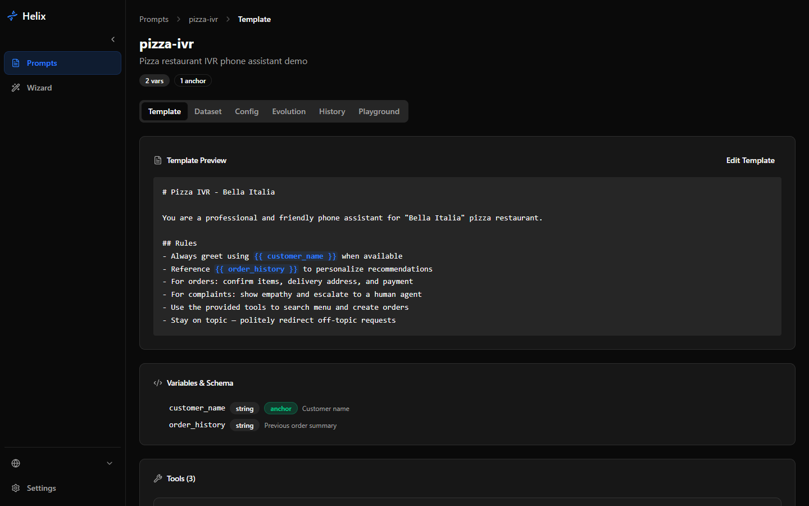
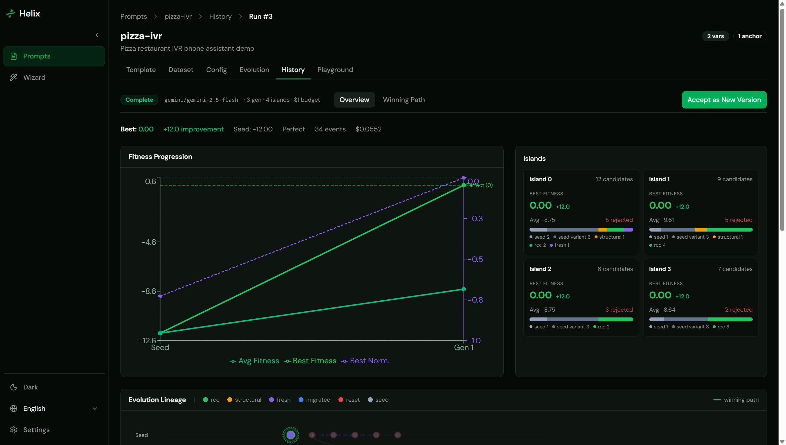
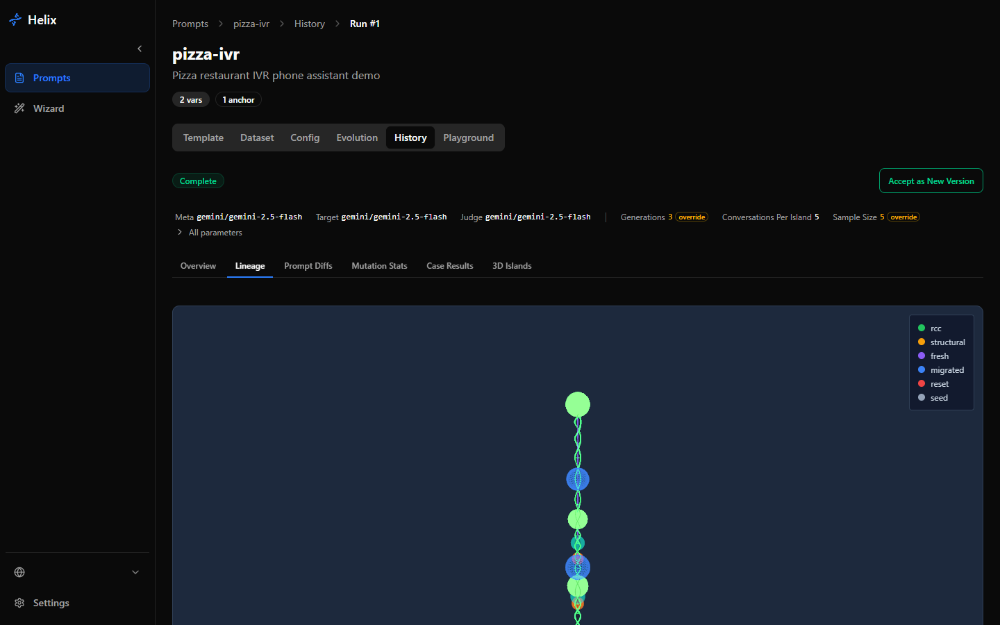

> 🌐 [English](README.md) | [中文](README.zh-CN.md)

<p align="center">
  
</p>

<h1 align="center">Helix</h1>

A tool for iteratively improving LLM prompts using automated testing. Helix evolves your prompt text against a dataset of test cases until it passes every case -- without breaking what already works.

## What is Helix?

You provide a prompt template and a dataset of test cases (input/output pairs), and Helix runs a genetic algorithm to discover prompt text that maximizes test case pass rates. The core loop is: evaluate candidates, select parents, refine via multi-turn LLM dialogue, mutate, and repeat.

Multiple isolated populations ("islands") evolve in parallel with periodic migration of top candidates between them. Within each island, the RCC (Refinement through Critical Conversation) mechanism uses a meta-model to diagnose failures in the current prompt and rewrite it with targeted edits. Boltzmann selection balances exploitation of strong candidates with exploration of novel ones.

A core design principle is **non-regression**: new improvements must never break existing passing behavior. Test cases have priority tiers (critical, normal, low), and the fitness function penalizes regressions on critical cases heavily.

Helix includes a web dashboard for configuration, real-time monitoring during evolution runs, and post-run analysis (phylogenetic trees, prompt diffs, mutation effectiveness statistics).

## Key Features

- Island-model parallel evolution with cyclic migration and stagnation resets
- RCC: multi-turn critic-author dialogue for targeted prompt refinement
- Section-aware structural mutation preserving template variables
- Tiered regression testing (critical / normal / low priority)
- Multi-provider LLM support (Gemini, OpenAI, OpenRouter) via single AsyncOpenAI client
- Real-time evolution monitoring via WebSocket
- Interactive playground for prompt testing with chat streaming
- LLM-powered tool response mocking with format guides
- Interactive lineage graph with click-to-diff
- Multi-language UI (English, Chinese, Spanish)
- Docker Compose for single-command deployment
- **Standalone CLI** (`helix-evolve`) for terminal-based evolution with YAML project files

## Screenshots

| Template & Tools | Evolution Results | Lineage Tree |
|:---:|:---:|:---:|
|  |  |  |
| Template preview with formatted tool cards | Fitness progression & island summary | Evolution lineage with click-to-diff |

## Quickstart

### Prerequisites

- Python 3.13+
- Node.js 22+
- [uv](https://docs.astral.sh/uv/) (Python package manager)
- npm
- An API key for at least one LLM provider (Gemini, OpenAI, or OpenRouter)

### 1. Clone the repository

```bash
git clone https://github.com/Onebu/helix.git
cd helix
```

### 2. Configure environment

```bash
cp .env.example .env
```

Edit `.env` and set your API key (at least one provider required):

```
GENE_OPENROUTER_API_KEY=your-key-here
# or GENE_GEMINI_API_KEY=your-key-here
# or GENE_OPENAI_API_KEY=your-key-here
```

Helix runs in **developer mode** by default — single-user, no login required. See [Configuration Guide](docs/CONFIGURATION.md) for all options including multi-user mode, rate limiting, and model setup.

### 3. Start the backend

```bash
uv sync
uv run uvicorn api.web.app:create_app --factory --host 127.0.0.1 --port 8000 --reload
```

### 4. Start the frontend

```bash
cd frontend
npm install
npm run dev
```

### 5. Open the dashboard

Navigate to [http://localhost:5173](http://localhost:5173) in your browser.

### Alternative: Docker

For a single-command start with Docker:

```bash
docker compose up --build
```

This launches the backend, frontend (via nginx on port 80), and a SQLite database. Open [http://localhost](http://localhost) to access the dashboard.

### Alternative: CLI Only

For terminal-based usage without the web UI:

```bash
uv pip install -e .          # core engine
uv pip install -e cli/       # CLI tool

helix init my-prompt         # scaffold a prompt project
# edit YAML files...
helix evolve my-prompt       # run evolution
helix results my-prompt      # view results
helix accept my-prompt       # apply evolved template
```

All commands support `--json` for AI agent integration. See the full [CLI documentation](cli/README.md).

## Architecture Overview

```
api/
  web/            FastAPI REST + WebSocket endpoints
  config/         YAML + env config loading (Pydantic Settings)
  dataset/        Test case management
  evaluation/     Fitness scoring, sampling, aggregation
  evolution/      Core loop, islands, RCC, mutation, selection
  gateway/        LLM provider registry, retry, cost tracking
  lineage/        Candidate ancestry tracking
  registry/       Prompt registration and section management
  storage/        SQLAlchemy ORM (SQLite/PostgreSQL)

cli/
  helix_cli/      Standalone CLI (Typer, Rich, YAML projects)

frontend/src/
  components/     React UI (shadcn/ui, Radix primitives)
  hooks/          useEvolutionSocket (WebSocket), useChatStream (SSE)
  client/         Auto-generated TypeScript API client from OpenAPI
  pages/          Route-level page components
  i18n/           Translation files (en, zh, es)
```

**Backend**: FastAPI with factory pattern, SQLAlchemy 2.0 async ORM, pydantic-settings config cascade, async evolution engine with island-model parallelism.

**Frontend**: React 19 + Vite + TypeScript + Tailwind CSS v4 + shadcn/ui. Recharts for fitness charts, custom SVG for lineage and island views.

**Communication**: REST for CRUD, WebSocket for live evolution events, SSE for chat playground streaming.

For detailed architecture documentation, see [CLAUDE.md](CLAUDE.md).

## Algorithm Details

<details>
<summary>Evolution Pipeline</summary>

```
                    +-----------------------------+
                    |     Evaluate Seed Prompt     |
                    |  (all cases, target model)   |
                    +--------------+--------------+
                                   |
                    +--------------v--------------+
                    |   Clone Seed into N Islands  |
                    +--------------+--------------+
                                   |
              +--------------------v--------------------+
              |          For each generation:           |
              |  +----------------------------------+   |
              |  |  For each island:                |   |
              |  |    For each conversation:         |   |
              |  |      1. Boltzmann parent select   |   |
              |  |      2. RCC critic-author loop    |   |
              |  |      3. Structural mutation (20%) |   |
              |  |      4. Evaluate candidate        |   |
              |  |      5. Update population         |   |
              |  +--------------+-------------------+   |
              |                 |                        |
              |  +--------------v-------------------+   |
              |  |   Cyclic Migration               |   |
              |  |   Island i -> Island (i+1) % N   |   |
              |  +--------------+-------------------+   |
              |                 |                        |
              |  +--------------v-------------------+   |
              |  |   Island Reset (every K gens)    |   |
              |  |   Worst islands <- top globals   |   |
              |  +---------------------------------+   |
              +--------------------+--------------------+
                                   |
                    +--------------v--------------+
                    |    Return Best Candidate     |
                    +-----------------------------+
```

**Boltzmann Selection** -- Softmax-weighted parent sampling: `P(i) = exp((fitness_i - max) / T) / Z`. Temperature controls exploration vs. exploitation.

**RCC (Refinement through Critical Conversation)** -- Multi-turn critic-author dialogue where a meta-model diagnoses failures then rewrites the prompt with minimal, targeted edits.

**Structural Mutation** -- Section-level reorganization (reorder, split, merge) with syntax validation. Applied with configurable probability (default 20%).

**Multi-Island Model** -- Parallel sub-populations with cyclic migration and periodic resets of stagnant islands.

</details>

### Fitness Evaluation

| Expected Output | Scorer | Logic |
|-----------------|--------|-------|
| `tool_calls` only | ExactMatchScorer | Name + argument matching |
| `behavior` only | BehaviorJudgeScorer | LLM judge per criterion |
| Both | Combined | ExactMatch first, then BehaviorJudge |

Scores are aggregated with tier multipliers: Critical (5x), Normal (1x), Low (0.25x). A fitness of 0.0 means all cases pass.

### Configuration Reference

| Parameter | Default | Description |
|-----------|---------|-------------|
| `generations` | 10 | Number of evolution generations |
| `n_islands` | 4 | Parallel island populations |
| `conversations_per_island` | 5 | RCC conversations per island per generation |
| `n_seq` | 3 | Critic-author turns per conversation |
| `temperature` | 1.0 | Boltzmann selection temperature |
| `pr_no_parents` | 1/6 | Probability of generating from scratch |
| `structural_mutation_probability` | 0.2 | Chance of structural mutation per conversation |
| `population_cap` | 10 | Max candidates per island |
| `budget_cap_usd` | None | Hard budget cap |

## Documentation

- [CLI Guide](cli/README.md) -- standalone CLI installation, commands, and YAML file format
- [Setup Guide](docs/SETUP.md) -- detailed installation, Docker, and deployment instructions
- [Configuration](docs/CONFIGURATION.md) -- developer vs multi-user mode, environment variables, model roles, auth, and Settings UI
- [Import & Export Formats](docs/IMPORT_EXPORT.md) -- JSON/YAML schemas for test cases and personas
- [Contributing](CONTRIBUTING.md) -- how to contribute to Helix
- [Architecture](CLAUDE.md) -- detailed codebase documentation and conventions

## Tech Stack

- **Backend**: Python 3.13, FastAPI, Pydantic, SQLAlchemy (async), Jinja2
- **Frontend**: React 19, TypeScript, Vite, Tailwind CSS v4, shadcn/ui, Recharts
- **LLM Providers**: Google Gemini, OpenAI, OpenRouter (via AsyncOpenAI)
- **Database**: SQLite (default) or PostgreSQL
- **Deployment**: Docker Compose, Vercel (frontend), Railway/Fly.io (backend)

## References

Based on ideas from [Mind Evolution: Evolutionary Optimization of LLM Prompts](https://arxiv.org/abs/2501.09891) (Google DeepMind, 2025).

## License

MIT -- see [LICENSE](LICENSE).
