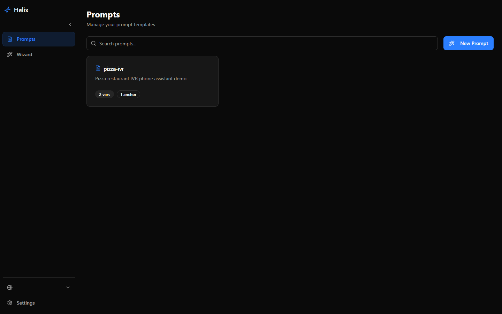
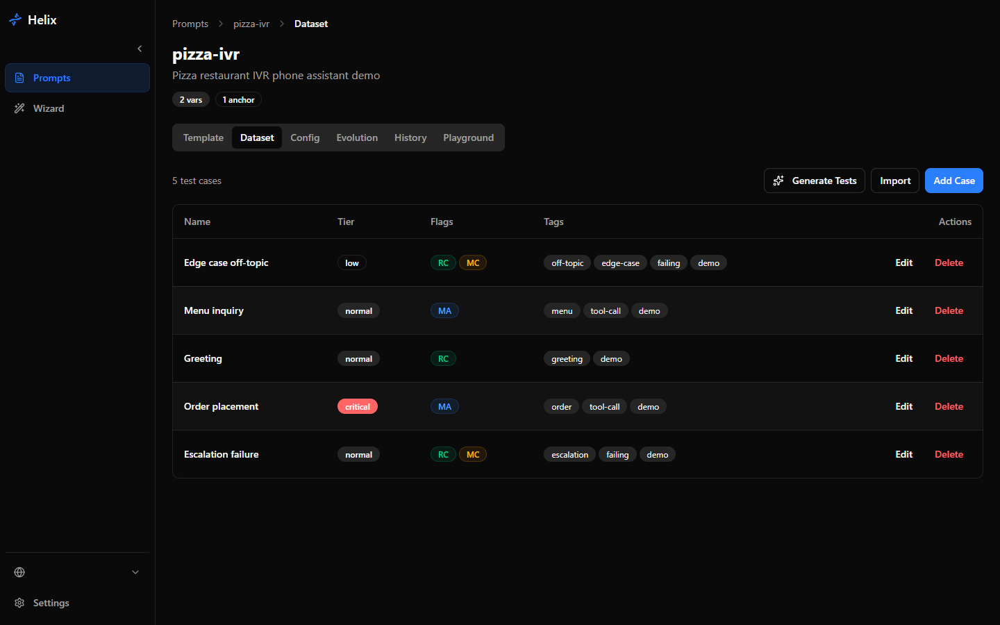
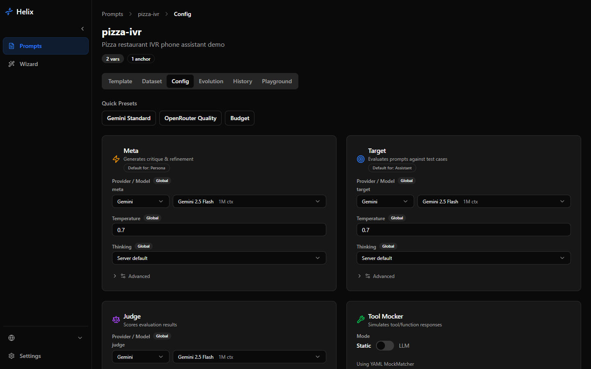
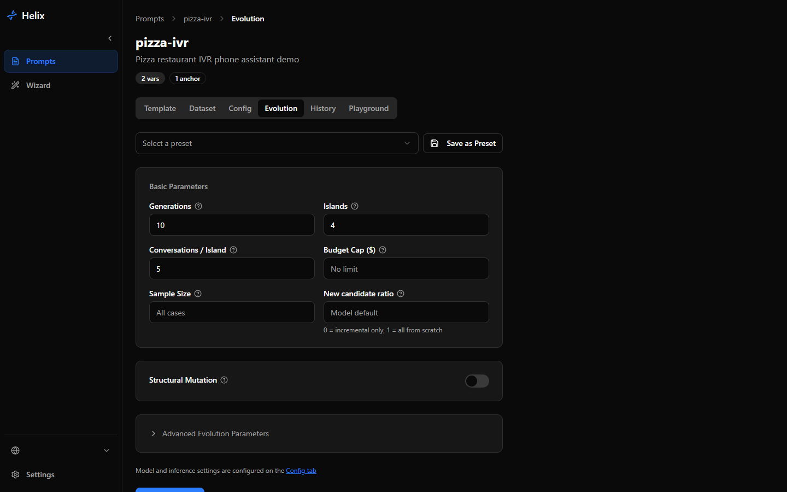
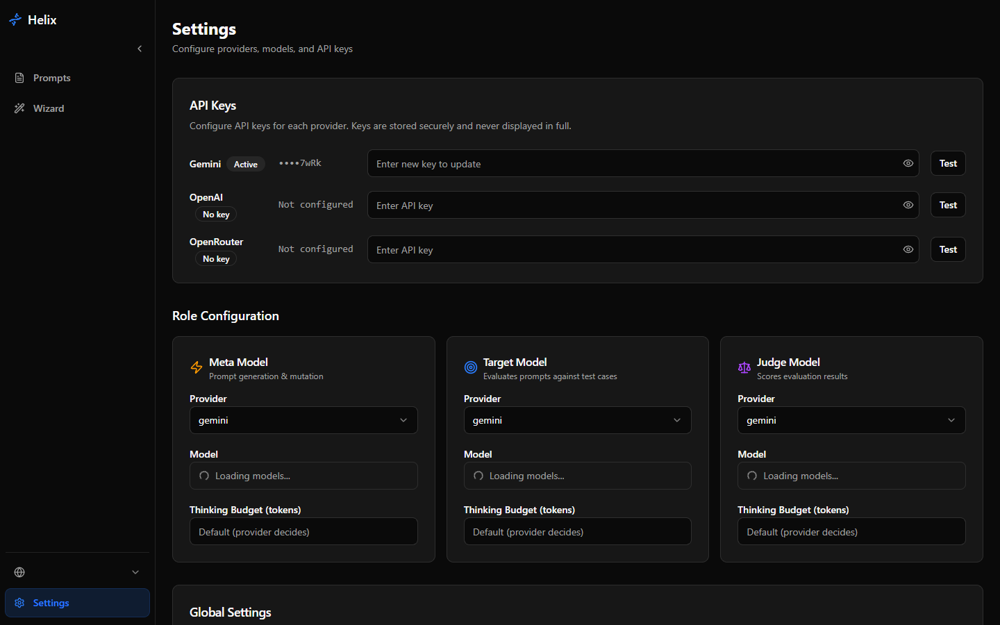

> 🌐 [English](README.md) | [中文](README.zh-CN.md)

# Helix

一个通过自动化测试迭代优化 LLM 提示词的工具。Helix 针对测试用例数据集进化你的提示词文本，直到所有测试用例通过——同时不破坏已有的功能。

## Helix 是什么？

你提供一个提示词模板和一组测试用例（输入/输出对），Helix 运行遗传算法来发现使测试用例通过率最大化的提示词文本。核心循环是：评估候选者、选择父代、通过多轮 LLM 对话进行优化、变异，然后重复。

多个隔离的种群（"岛屿"）并行进化，并定期在岛屿之间迁移顶级候选者。在每个岛屿内部，RCC（通过批判性对话进行优化）机制使用元模型来诊断当前提示词中的失败，并通过针对性编辑来重写它。玻尔兹曼选择在利用强候选者和探索新颖候选者之间取得平衡。

核心设计原则是**不退化**：新的改进绝不能破坏已通过的行为。测试用例有优先级层级（关键、普通、低优先级），适应度函数会严重惩罚关键用例的退化。

Helix 包含一个 Web 仪表板，用于配置、进化运行期间的实时监控和运行后分析（系谱树、提示词差异、变异效果统计）。

## 主要特性

- 岛屿模型并行进化，支持循环迁移和停滞重置
- RCC：多轮批评者-作者对话，用于针对性提示词优化
- 基于段落的结构变异，保留模板变量
- 分层回归测试（关键 / 普通 / 低优先级）
- 多提供商 LLM 支持（Gemini、OpenAI、OpenRouter、Anthropic）通过单一 AsyncOpenAI 客户端
- 通过 WebSocket 实时监控进化过程
- 交互式游乐场，支持聊天流式传输进行提示词测试
- LLM 驱动的工具响应模拟与格式指南
- 3D 可视化（岛屿拓扑、谱系树）
- 多语言 UI（英文、中文、西班牙文）
- Docker Compose 一键部署

## 截图

### 提示词仪表板


### 模板预览


### 数据集与测试用例


### 配置 — 模型角色


### 进化 — 实时监控


### 运行结果 — 适应度与分析


### 设置


## 快速开始

### 前置条件

- Python 3.13+
- Node.js 22+
- [uv](https://docs.astral.sh/uv/)（Python 包管理器）
- npm
- 至少一个 LLM 提供商的 API 密钥（Gemini、OpenAI、OpenRouter 或 Anthropic）

### 1. 克隆仓库

```bash
git clone https://github.com/Onebu/helix.git
cd helix
```

### 2. 配置环境

```bash
cp .env.example .env
```

编辑 `.env` 并设置你的 API 密钥：

```
GENE_GEMINI_API_KEY=your-key-here
```

所有可用选项请参见[环境变量参考](docs/SETUP.md#environment-variables-reference)。

### 3. 启动后端

```bash
uv sync
uv run uvicorn api.web.app:create_app --factory --host 127.0.0.1 --port 8000 --reload
```

### 4. 启动前端

```bash
cd frontend
npm install
npm run dev
```

### 5. 打开仪表板

在浏览器中导航至 [http://localhost:5173](http://localhost:5173)。

### 替代方案：Docker

使用 Docker 一键启动：

```bash
docker compose up --build
```

这将启动后端、前端（通过 nginx 在端口 80）和 SQLite 数据库。访问 [http://localhost](http://localhost) 使用仪表板。

## 架构概览

```
api/
  web/            FastAPI REST + WebSocket 端点
  config/         环境变量配置加载（Pydantic Settings）
  dataset/        测试用例管理
  evaluation/     适应度评分、采样、聚合
  evolution/      核心循环、岛屿、RCC、变异、选择
  gateway/        LLM 提供商注册、重试、成本追踪
  lineage/        候选者谱系追踪
  registry/       提示词注册和段落管理
  storage/        SQLAlchemy ORM（SQLite/PostgreSQL）

frontend/src/
  components/     React UI（shadcn/ui、Radix 基础组件）
  hooks/          useEvolutionSocket（WebSocket）、useChatStream（SSE）
  client/         从 OpenAPI 自动生成的 TypeScript API 客户端
  pages/          路由级页面组件
  i18n/           翻译文件（en、zh、es）
```

**后端**：FastAPI 工厂模式，SQLAlchemy 2.0 异步 ORM，pydantic-settings 配置级联，具有岛屿模型并行性的异步进化引擎。

**前端**：React 19 + Vite + TypeScript + Tailwind CSS v4 + shadcn/ui。Recharts 用于适应度图表，D3 用于系谱树，React Three Fiber 用于 3D 视图（延迟加载）。

**通信**：REST 用于 CRUD，WebSocket 用于实时进化事件，SSE 用于聊天游乐场流式传输。

详细架构文档请参见 [CLAUDE.md](CLAUDE.md)。

## 算法详情

<details>
<summary>进化流程</summary>

```
                    +-----------------------------+
                    |     评估种子提示词            |
                    |  (所有用例, 目标模型)          |
                    +--------------+--------------+
                                   |
                    +--------------v--------------+
                    |   克隆种子到 N 个岛屿         |
                    +--------------+--------------+
                                   |
              +--------------------v--------------------+
              |          每一代:                         |
              |  +----------------------------------+   |
              |  |  每个岛屿:                        |   |
              |  |    每次对话:                       |   |
              |  |      1. 玻尔兹曼父代选择           |   |
              |  |      2. RCC 批评者-作者循环        |   |
              |  |      3. 结构变异 (20%)             |   |
              |  |      4. 评估候选者                 |   |
              |  |      5. 更新种群                   |   |
              |  +--------------+-------------------+   |
              |                 |                        |
              |  +--------------v-------------------+   |
              |  |   循环迁移                         |   |
              |  |   岛屿 i -> 岛屿 (i+1) % N        |   |
              |  +--------------+-------------------+   |
              |                 |                        |
              |  +--------------v-------------------+   |
              |  |   岛屿重置 (每 K 代)               |   |
              |  |   最差岛屿 <- 全局最优             |   |
              |  +---------------------------------+   |
              +--------------------+--------------------+
                                   |
                    +--------------v--------------+
                    |    返回最佳候选者              |
                    +-----------------------------+
```

**玻尔兹曼选择** — Softmax 加权父代采样：`P(i) = exp((fitness_i - max) / T) / Z`。温度控制探索与利用的平衡。

**RCC（通过批判性对话进行优化）** — 多轮批评者-作者对话，元模型诊断失败然后用最小、针对性的编辑重写提示词。

**结构变异** — 段落级重组（重排、拆分、合并），带语法验证。以可配置概率应用（默认 20%）。

**多岛屿模型** — 并行子种群，循环迁移并定期重置停滞的岛屿。

</details>

### 适应度评估

| 预期输出 | 评分器 | 逻辑 |
|---------|--------|------|
| 仅 `tool_calls` | ExactMatchScorer | 名称 + 参数匹配 |
| 仅 `behavior` | BehaviorJudgeScorer | LLM 裁判逐条评估 |
| 两者都有 | 组合 | 先 ExactMatch，然后 BehaviorJudge |

分数按层级乘数聚合：关键 (5x)、普通 (1x)、低 (0.25x)。适应度为 0.0 表示所有用例通过。

### 配置参考

| 参数 | 默认值 | 描述 |
|------|--------|------|
| `generations` | 10 | 进化代数 |
| `n_islands` | 4 | 并行岛屿种群数 |
| `conversations_per_island` | 5 | 每岛每代 RCC 对话数 |
| `n_seq` | 3 | 每次对话的批评者-作者轮数 |
| `temperature` | 1.0 | 玻尔兹曼选择温度 |
| `pr_no_parents` | 1/6 | 从零生成的概率 |
| `structural_mutation_probability` | 0.2 | 每次对话结构变异概率 |
| `population_cap` | 10 | 每岛最大候选者数 |
| `budget_cap_usd` | None | 硬性预算上限 |

## 文档

- [安装指南](docs/SETUP.md) — 详细的安装、Docker 和部署说明
- [配置](docs/CONFIGURATION.md) — 环境变量、模型角色和设置界面
- [导入导出格式](docs/IMPORT_EXPORT.md) — 测试用例和角色的 JSON/YAML 格式
- [贡献指南](CONTRIBUTING.md) — 如何为 Helix 做贡献
- [架构](CLAUDE.md) — 详细的代码库文档和规范

## 技术栈

- **后端**：Python 3.13、FastAPI、Pydantic、SQLAlchemy（异步）、Jinja2
- **前端**：React 19、TypeScript、Vite、Tailwind CSS v4、shadcn/ui、Recharts、D3
- **LLM 提供商**：Google Gemini、OpenAI、OpenRouter、Anthropic（通过 AsyncOpenAI）
- **数据库**：SQLite（默认）或 PostgreSQL
- **部署**：Docker Compose、Vercel（前端）、Railway/Fly.io（后端）

## 参考文献

基于 [Mind Evolution: Evolutionary Optimization of LLM Prompts](https://arxiv.org/abs/2501.09891)（Google DeepMind, 2025）的思想。

## 许可证

MIT — 请参见 [LICENSE](LICENSE)。
